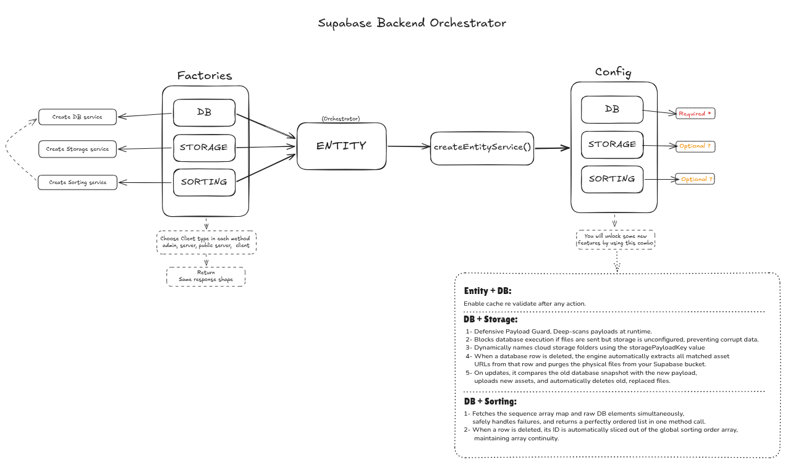
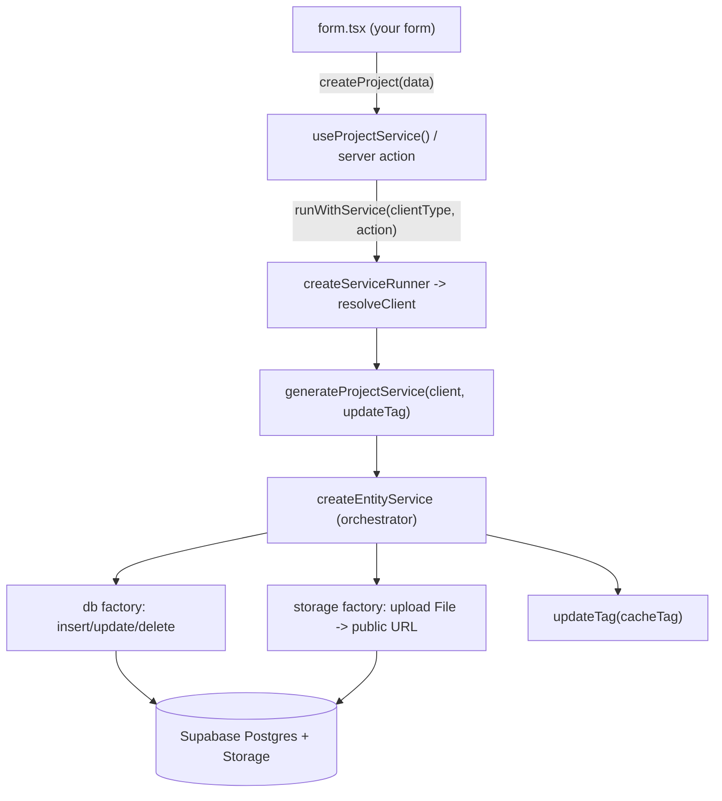
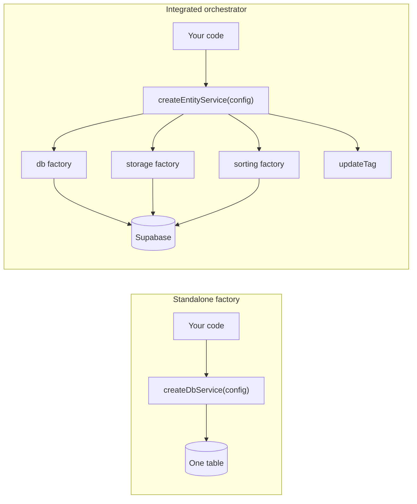

# Entity Service Layer (Supabase + Next.js)

A reusable architecture to avoid repeating CRUD logic across Supabase-backed features.

**The Lazy Dev philosophy:** you write the thin call site, the layer does the rest. The painful, repetitive parts of Supabase + Next.js — slugifying file names, uploading to Storage, fetching public URLs, diffing replaced images, invalidating cache tags, picking the right client for the right context — are solved once in `services/core/`. Every new table is ~30 lines of config and a one-line `service.create({ payload })`.

## Key features

Supabase + Next.js patterns that are usually painful — client types, caching, file uploads, RLS contexts — are solved once in the core layer. Each entity is ~30 lines of config.

- **One-line CRUD** — `create`, `update`, `remove`, `getById`, `get`, `getAll`, `getAllSorted`, `saveSort` on every entity, no per-table boilerplate.
- **Automatic file handling** — drop a `File` in your payload and it is uploaded, renamed uniquely, and its public URL saved in the row. Removals and replacements are cleaned up for you.
- **Four Supabase clients, one swap** — server (auth), public (cache-safe), admin (RLS bypass) resolved per call by the runner; browser injected via the `client.ts` hook — never module-scoped.
- **Cache-correct by default** — writes call `updateTag`; cached reads use the cookie-free public client so `unstable_cache` never breaks.
- **Uniform responses** — every method returns `{ data, success, error, message }`.
- **Typed end to end** — pass your own payload/record types; `data` is typed at the call site.
- **Copy-paste templates + scaffold script** — single- or multi-client starter; scaffold a table in seconds with `npm run entity:generate`.

See [Database operations](#database-operations) and [Storage / image uploads](#storage--image-uploads) for the full picture.

---

## Install

Drop the layer into an existing Next.js + Supabase project with one command:

```bash
npx create-supabase-orchestrator
```

This scaffolds three folders into your project:

- `services/core/` — the engine (orchestrator + db/storage/sorting factories)
- `services/entities/` — the `templates/` and `standalone-factories/` starting points
- `lib/supabase/` — the four client factories the services depend on

It writes under `src/` automatically when a `src/` folder exists, otherwise at the project root. If any of those folders already exist, it lists them and asks you to type `overwrite` to proceed or anything else to cancel — nothing is touched until you confirm. Pass `--force` (or `-y`) to skip the prompt in CI.

After scaffolding, make sure your project has:

- the `@/*` path alias in `tsconfig.json`, e.g. `"paths": { "@/*": ["./src/*"] }`
- the peer dependencies: `npm i @supabase/supabase-js @supabase/ssr next`

### Generate an entity

Create a new entity from the bundled templates without copying folders by hand:

```bash
npx create-supabase-orchestrator entity blog          # single-client (default)
npx create-supabase-orchestrator entity blog multi    # multi-client (adds client.ts)
```

It clones the matching template into `services/entities/blog/` (under `src/` when present), swaps the naming placeholders (`feature` → `blog`, `Feature` → `Blog`, `your-feature` → `blog`), and refuses to overwrite an existing entity. See [Scaffolding](#scaffolding) for the in-repo equivalent (`npm run entity:generate`).

---

## Before vs. After

The same task — insert a row with an uploaded image and invalidate the cache — done by hand versus done through the service.

**Before** — manual Supabase, repeated for every table:

```ts
const supabase = await createServerClient();

const slug = title.toLowerCase().replace(/\s+/g, "-");
const ext = image.name.split(".").pop();
const path = `projects/${slug}/cover-${Date.now()}.${ext}`;

const { error: uploadError } = await supabase.storage.from("projects").upload(path, image);
if (uploadError) return { success: false, error: uploadError.message };

const {
  data: { publicUrl },
} = supabase.storage.from("projects").getPublicUrl(path);

const { data, error } = await supabase
  .from("projects")
  .insert({ title, image: publicUrl })
  .select()
  .single();
if (error) return { success: false, error: error.message };

updateTag("projects");
return { success: true, data };
```

**After** — every entity, every table:

```ts
const { data, success } = await service.create({ payload });
// File upload, unique naming, public URL, and updateTag all handled
```

The upload, the unique path, the public URL, the typed insert, and the cache tag are all handled by the layer. You only ever describe the table once (see [Feature configuration](#feature-configuration--the-usage)).

---

## Architecture



---

## End-to-end flow

From a form submit to Supabase, here is the whole path — note that you only ever write the thin call site; everything else is handled by the layer:



1. A component calls a thin action/hook with a typed payload.
2. `runWithService(clientType, action)` resolves the right server-side client (server / admin / public); client components bind the browser client through the `client.ts` hook.
3. The orchestrator uploads any `File` fields, runs the DB op, then invalidates the cache tag with `updateTag`.
4. A uniform `{ data, success, error, message }` comes back.

The real call site stays this small:

```ts
// components/form.tsx
const projectService = useProjectService();
const onSubmit = (data: ProjectData) => projectService.createProject(data);
// image: File -> uploaded automatically -> row stored with its public URL
```

---

## Where to Import

Every entity exposes its functionality through two (or three) entry points. Import from the one that matches your runtime — **never reach into `core.ts`**.

| Import from                            | Use in                            | Exposes                                                  |
| -------------------------------------- | --------------------------------- | -------------------------------------------------------- |
| `@/services/entities/{feature}/client` | Client Components                 | `useFeatureService()` hook (bound to the browser client) |
| `@/services/entities/{feature}/server` | Server Actions, Server Components | `"use server"` actions returning `response()`            |
| `@/services/entities/{feature}/core`   | nothing — internal only           | raw client-bound service factory                         |

- **Client Components** → `@/services/entities/{feature}/client`. The hook memoizes a browser-client-bound service for instant UI updates.
- **Server Actions / Server Components** → `@/services/entities/{feature}/server`. These wrappers resolve the correct client per request and are the only thing components should call for server work.
- **Avoid `core.ts`** → it exposes the raw, client-bound service factory (`generateFeatureService` / `getFeatureService`). Importing it from a component leaks the client-resolution detail and breaks the clean separation between runtime entry points. Treat it as internal to `server.ts` and `client.ts`.

---

## Under the Hood

Read this bottom-up: small **pure builders** at the base, a **manager** that wires them together, and your **config** on top.

### Factories — the pure builders

`services/core/factories/` holds three stateless builders. Each takes a Supabase client plus its slice of config and returns one capability — nothing more:

- **`factories/db.ts`** — raw table operations: `insert().select().single()`, `update`, `delete`, and filtered `select`.
- **`factories/storage.ts`** — file lifecycle: recursively collect `File`s, upload to predictable paths, diff/replace on update, and clean up on delete.
- **`factories/sorting.ts`** — persisted manual order: `createSort`, `getSort`, and sorted reads.

They are "pure" in the sense that they hold no app state and make no decisions about caching or which client to use — give them a client and a config and they just build.

### Orchestrator — the manager

`services/core/entity.ts` exports `createEntityService`, the manager that wires the factories together and owns the sequencing the factories deliberately avoid:

- Calls the storage factory first (upload `File`s → public URLs), then the db factory (write the row), then `updateTag` on success.
- On update it fetches the current row so the storage factory can diff replaced/removed images; on delete it removes the row's files and its sort entry.
- Normalizes everything into the uniform `{ data, success, error, message }` response.

It is the only layer that calls `updateTag` — the factories never touch the cache.

### Feature configuration — the usage

A feature is just a config object plus a choice of how the client is bound. The config is the **same for every entity** — table, storage, and sorting, with **no client inside**. Define `featureServiceConfig` once:

```ts
import { createEntityService } from "@/services/core/entity";
import { EntityServiceConfig } from "@/services/core/types";

export const featureServiceConfig: EntityServiceConfig = {
  dbServiceConfig: {
    tableName: "your_table",
    cacheTag: "your-cache-tag",
    primaryKey: "id",
  },
  storageServiceConfig: {
    bucketName: "your_bucket",
    groupFolder: "your_folder",
  },
  sortingServiceConfig: {
    tableName: "sort",
    sortRowId: "your_table",
    primaryKey: "column_id",
  },
};
```

The only difference between entities is **how the Supabase client is bound** to that config — pick one:

```ts
// Server-only: always the authenticated server client (articles/, templates/single-client/)
import { createServerClient } from "@/lib/supabase/server";
import { updateTag } from "next/cache";

export const getFeatureService = async () => {
  const client = await createServerClient();
  return createEntityService({
    supabaseClient: client,
    updateTag,
    ...featureServiceConfig,
  });
};

// Any client passed in — server, admin, public, or browser (projects/, templates/multi-client/)
import type { SupabaseClient } from "@supabase/supabase-js";

export const generateFeatureService = (client: SupabaseClient, updateTag?: (tag: string) => void) =>
  createEntityService({
    supabaseClient: client,
    updateTag,
    ...featureServiceConfig,
  });
```

For the multi-client generator, `server.ts` uses the runner to resolve the client per call and inject `updateTag`:

```ts
import { createServiceRunner } from "@/services/core/runtime/runner";

const runWithService = createServiceRunner(generateFeatureService);

export const createFeature = async ({ payload }: { payload: YourSchemaType }) =>
  runWithService("server", (service) => service.create({ payload }));

export const createFeatureAsAdmin = async ({ payload }: { payload: YourSchemaType }) =>
  runWithService("admin", (service) => service.create({ payload }));
```

| Config block                | Required | Description                                                        |
| --------------------------- | -------- | ------------------------------------------------------------------ |
| `dbServiceConfig.tableName` | yes      | Supabase table name                                                |
| `dbServiceConfig.cacheTag`  | yes      | Tag used for `updateTag` on writes                                 |
| `storageServiceConfig`      | no       | Enables automatic file upload/remove on create/update/delete       |
| `sortingServiceConfig`      | no       | Enables `getSort`, `saveSort`, `getAllSorted`                      |
| `supabaseClient`            | yes      | Always passed at service creation — never in `EntityServiceConfig` |

Omit `storageServiceConfig` or `sortingServiceConfig` when not needed, or remove both for db-only entities.

**Server-only vs. any-client at a glance:**

- **Server-only** (`articles/`, `templates/single-client/`) — `core.ts` exports an async `getFeatureService()` that always binds `createServerClient()`. `server.ts` calls it in each action.
- **Any client** (`projects/`, `templates/multi-client/`) — `core.ts` exports a pure `generateFeatureService(client)`. `server.ts` builds `runWithService = createServiceRunner(generateFeatureService)` and each action picks the client with `runWithService(clientType, action)` (`"server"` by default, `"admin"`/`"public"` overrides); `client.ts` passes `createBrowserClient()` for browser usage.

Both start from the identical config object; pick the binding that matches where the entity is used.

`server.ts` keeps the thin wrappers (`"use server"`, returning `response()`), sorting orchestration, cached reads, and any manual upload logic for nested/complex fields the factory cannot cover.

---

## Modularity: Use the Parts or the Whole

`createEntityService` (the Orchestrator) is the primary way to build a full-featured entity — it wires the db, storage, and sorting factories together and owns cache invalidation. But you are never forced to take the whole pipeline. Each factory — `createDbService`, `createStorageService`, `createSortingService` — is a standalone, pure builder you can use on its own, with none of the Orchestrator's overhead.

Need plain table access for a simple lookup table? Reach for the db factory directly:

```ts
import { createDbService } from "@/services/core/factories/db";

// A simple lookup table — no storage, no sorting, no cache wiring
const tags = createDbService({ tableName: "tags", supabaseClient });
const { data } = await tags.getAll({});
```

This is the Lazy Dev payoff cut both ways: reach for a **single factory** when you need exactly one capability, or reach for the **Orchestrator** when you want the whole pipeline (uploads + db + sorting + cache) in one call. It is a flexible toolkit, not an all-or-nothing framework.

Runnable examples of each factory used on its own live in `entities/standalone-factories/` (`db-only.ts`, `storage-only.ts`, `sorting-only.ts`).



---

## Folder structure

```txt
services/
├── core/
│   ├── entity.ts              # createEntityService — the Orchestrator (manager)
│   ├── factories/             # pure builders
│   │   ├── db.ts
│   │   ├── storage.ts
│   │   └── sorting.ts
│   ├── runtime/               # per-request client resolution
│   │   ├── runner.ts          # createServiceRunner -> runWithService(clientType, action)
│   │   └── serverResolver.ts  # resolveClient(type) — server / public / admin
│   ├── types/
│   └── README.MD
│
├── entities/
│   ├── templates/
│   │   ├── single-client/        # copy-paste starter (server-only, one client)
│   │   └── multi-client/         # copy-paste starter (browser + admin + public)
│   ├── standalone-factories/     # use one factory alone (db / storage / sorting)
│   ├── articles/                 # live single-client example
│   └── projects/                 # live multi-client example
│
└── etc...
```

### Templates

| Template                   | Files                               | `core.ts` exports                                         | `server.ts`                                             |
| -------------------------- | ----------------------------------- | --------------------------------------------------------- | ------------------------------------------------------- |
| `templates/single-client/` | `core.ts`, `server.ts`              | `featureServiceConfig` + `getFeatureService()`            | Calls `getFeatureService()` from core                   |
| `templates/multi-client/`  | `core.ts`, `server.ts`, `client.ts` | `featureServiceConfig` + `generateFeatureService(client)` | `createServiceRunner` + `runWithService(clientType, …)` |

Live examples: `entities/articles/` (single client), `entities/projects/` (multi client), and `entities/standalone-factories/` (one factory at a time).

---

## Database operations

Each service exposes the same methods. All take object params and return `ApiResponse<T>` (`{ data, success, error, message }`). Pass your `Record` type to type `data` at the call site.

### Create

```ts
const { data, success } = await service.create({ payload });
```

Inserts one row (`.insert().select().single()`), uploads any `File` fields first, then revalidates the cache tag.

### Update

```ts
await service.update({ id, payload });
```

Updates by `primaryKey`. Fetches the current row first so file changes can be diffed (a new `File` replaces and deletes the old one; an unchanged URL is kept).

### Delete

```ts
await service.remove({ id });
```

Deletes the row, then removes its storage files and its sort-order entry. Cache is revalidated on success.

### Read one

```ts
await service.getById<Record>({ id }); // by primary key
await service.get<Record>({ where: { slug }, shape: "single" }); // by unique field -> T | null
```

### Read many

```ts
await service.getAll<Record>({}); // all rows
await service.get<Record>({ where: { status: "approved" } }); // filtered
await service.get<Record>({ where, limit, orderBy: { column, ascending } }); // filter + sort + limit
```

### Sorted reads / saving order

```ts
await service.saveSort({ ids: [3, 1, 2] }); // persist manual order
await service.getAllSorted<Record>({}); // rows in saved order
await service.getAllSorted<Record>({ where: { status: "approved" } });
```

### At a glance

| Method                 | Params                                 | Returns              | Notes                         |
| ---------------------- | -------------------------------------- | -------------------- | ----------------------------- |
| `create`               | `{ payload }`                          | `T`                  | uploads files, revalidates    |
| `update`               | `{ id, payload }`                      | `T`                  | diffs files, revalidates      |
| `remove`               | `{ id }`                               | `T`                  | cleans storage + sort entry   |
| `getById`              | `{ id }`                               | `T`                  | primary-key lookup            |
| `get`                  | `{ where?, limit?, orderBy?, shape? }` | `T[]` or `T \| null` | `shape: "single"` for one row |
| `getAll`               | `{}`                                   | `T[]`                | full table                    |
| `getAllSorted`         | `{ where? }`                           | `T[]`                | respects saved order          |
| `saveSort` / `getSort` | `{ ids }` / `{}`                       | order row            | needs `sortingServiceConfig`  |

See [Query shape](#query-shape-get) and [Typed responses](#typed-responses) for return-type details.

---

## Storage / image uploads

When `storageServiceConfig` is set, `createEntityService` handles uploads automatically — you never call the Storage API yourself for standard fields. Enable it once:

```ts
storageServiceConfig: {
  bucketName: "your_bucket",
  groupFolder: "projects",
  payloadKey: "title", // optional — file folder slug comes from this field
}
```

What makes it easy:

- **Deep payload scan** — `collectFiles` recursively finds every `File` in the payload (top-level or nested), so uploads are wired automatically for standard fields.
- **Predictable paths** — files land at `groupFolder/{slug}/{name}-id-{timestamp}.{ext}`. The `slug` comes from `payloadKey` (falling back to `title`, `slug`, `name`, then `id`), and filenames are sanitized and timestamped to avoid collisions.
- **Smart updates** — on update, new `File`s upload and any old asset URL no longer present in the payload is deleted (`collectUrls` diff). Unchanged `string` URLs are skipped.
- **Full cleanup on delete** — `removeTree` deletes all matching bucket files for the row.
- **Form convention** — pass a `File` for a new or replaced image, a `string` URL to keep the existing one.

Lifecycle:

| Operation  | You pass                     | Orchestrator does                                                       |
| ---------- | ---------------------------- | ----------------------------------------------------------------------- |
| **create** | `File` field(s)              | upload → store public URL(s) in the new row                             |
| **create** | only strings                 | plain insert, no storage call                                           |
| **update** | new `File`                   | upload new, delete the replaced old file                                |
| **update** | unchanged URL                | left as-is                                                              |
| **update** | URL removed from payload     | old file deleted from bucket                                            |
| **remove** | `{ id }`                     | row deleted, then all its bucket files removed                          |
| **nested** | `File` inside arrays/objects | uploaded too (scan is recursive); manual cleanup only for exotic shapes |

If a payload contains `File`s but no `storageServiceConfig` is set, `create`/`update` return a `"Storage service is not enabled"` error (`validateStorageRequirement`). For nested uploads in unusual shapes (e.g. `sub_items[].image`), keep manual cleanup logic in `server.ts`.

---

## Response shape

Every action returns:

```ts
{
  data,
  success,
  error,
  message,
}
```

Use destructuring at call sites:

```ts
const { data, success, error, message } = await createProject({ payload });
const { data: isAdminUser } = await isAdmin({ userId });
```

---

## Param conventions

See [Database operations](#database-operations) for the full method list. Use **object params** for any action that takes arguments:

```ts
createFeature({ payload });
updateFeature({ id, payload });
deleteFeature({ id });
saveFeaturesSort({ ids });
getFeatureById({ id });
getProjectBySlug({ slug });
```

No-arg reads need no wrapper:

```ts
getFeatures();
getSortedProjects();
```

---

## Query shape (`get`)

`get()` accepts an optional `shape` param that controls the return type:

| `shape`            | Returns     | Use when                       |
| ------------------ | ----------- | ------------------------------ |
| `"list"` (default) | `T[]`       | Multiple rows (filters, lists) |
| `"single"`         | `T \| null` | One row by slug, route, etc.   |

```ts
// many rows
await featureService.get({ where: { status: "approved" } });

// one row — no data[0] unwrapping
await featureService.get({ where: { slug: "my-project" }, shape: "single" });
```

Use `getById({ id })` for primary-key lookups. Use `get({ where, shape: "single" })` for unique field lookups.

---

## Typed responses

Entity and db methods are generic — pass your data type so `data` is typed at the call site. All methods return `ApiResponse<T>` where `data` is `T | null`.

| Method                     | Generic                                | `data` type |
| -------------------------- | -------------------------------------- | ----------- |
| `create`                   | inferred from `payload`                | `T`         |
| `update`                   | inferred from `payload`                | `T`         |
| `remove`                   | optional (defaults to `PayloadRecord`) | `T`         |
| `getById`                  | required at call site                  | `T`         |
| `getAll`                   | required at call site                  | `T[]`       |
| `get({ shape: "list" })`   | required at call site                  | `T[]`       |
| `get({ shape: "single" })` | required at call site                  | `T \| null` |
| `getAllSorted`             | required at call site                  | `T[]`       |

```ts
import type { ProjectRecord, ProjectData } from "@/schemas/projectSchema";

// Payload types — the data objects you pass to create/update
// Record types — DB rows (reads), e.g. YourRecord = YourData & { id: number }

// writes — T inferred from payload
await projectService.create({ payload: data });
await projectService.update({ id, payload: data });

// reads — pass Record type explicitly
const { data: row } = await projectService.getById<ProjectRecord>({ id });
const { data: rows } = await projectService.getAll<ProjectRecord>({});
const { data: approved } = await projectService.getAllSorted<ProjectRecord>({
  where: { status: "approved" },
});
```

Inner factory responses use `success` (not `!error`) before cache invalidation and before returning to actions.

---

## Client types

Four Supabase clients are available from `@/lib/supabase`:

| Client  | Factory                      | Use case                                                    |
| ------- | ---------------------------- | ----------------------------------------------------------- |
| Server  | `createServerClient()`       | Cookie-aware, authenticated server actions (default writes) |
| Public  | `createPublicServerClient()` | Cache-safe reads inside `unstable_cache` (no cookies)       |
| Admin   | `createAdminClient()`        | Bypass RLS for admin operations                             |
| Browser | `createBrowserClient()`      | Client components via `client.ts` hook                      |

Multi-client entities select a server-side client with `runWithService(clientType, action)`; the browser client is bound separately in `client.ts`. Single-client entities always use `createServerClient()` via `getFeatureService()` in core.

```ts
// @/services/core/runtime/serverResolver
type ServerClientType = "server" | "public" | "admin";
```

`resolveClient(type)` (in `services/core/runtime/serverResolver.ts`) maps a `ServerClientType` to the matching client and is what `createServiceRunner` calls under the hood — `"browser"` is not resolved here; use the `client.ts` hook for browser usage.

---

## Sorting

When `sortingServiceConfig` is set:

```ts
await featureService.saveSort({ ids: [1, 2, 3] });
await featureService.getSort();
// sort entry is removed automatically on remove()
```

Fetch sorted rows via `getAllSorted({})`:

```ts
await featureService.getAllSorted({});
await featureService.getAllSorted({ where: { status: "approved" } });

export const getSortedItems = unstable_cache(
  async () => runWithService("public", (service) => service.getAllSorted({})),
  ["sorted-items"],
  { tags: [featureServiceConfig.dbServiceConfig.cacheTag ?? ""] },
);
```

---

## Caching

Only **`entity.ts`** calls `updateTag` — not `factories/db.ts`. Cache tags live on `dbServiceConfig.cacheTag` and are invalidated after successful writes (`create`, `update`, `remove`, `saveSort`).

Wrap custom reads with `unstable_cache` and the same tag. Resolve the public client with `runWithService("public", …)` inside the cache callback — never the server client (cookies break caching). Requires the multi-client pattern so the runner can pick the public client:

```ts
export const getSortedApprovedItems = unstable_cache(
  async () =>
    runWithService("public", (service) => service.getAllSorted({ where: { status: "approved" } })),
  ["sorted-approved-items"],
  { tags: [featureServiceConfig.dbServiceConfig.cacheTag ?? ""] },
);
```

If you need cached public reads, use `templates/multi-client/` so `runWithService("public", …)` is available.

---

## Scaffolding

Spin up a new entity without copy-pasting folders by hand. The repo ships a generator that clones a template and swaps the placeholders for you:

```bash
npm run entity:generate blog            # single-client (default)
npm run entity:generate blog multi      # multi-client (also adds client.ts)
```

This copies the matching template from `services/entities/templates/` into `services/entities/blog/` and replaces the naming placeholders (`feature` → `blog`, `Feature` → `Blog`, `your-feature` → `blog`). It refuses to overwrite an existing entity folder.

Then finish the entity by hand:

1. Replace the remaining domain placeholders (`your_table`, `your-cache-tag`, `YourData`, `YourRecord`, ...).
2. Add your payload/record type definitions in `@/schemas/`.
3. Import actions from `server.ts` (and the hook from `client.ts`) in components — never import the entity service from `core.ts`.

The script is wired up once in `package.json`:

```json
"scripts": {
  "entity:generate": "node scripts/generate-entity.mjs"
}
```

---

## Adding a new entity

Prefer the [scaffold script](#scaffolding) above. To do it manually:

| Need                                               | Copy                       |
| -------------------------------------------------- | -------------------------- |
| Server-only, one authenticated client              | `templates/single-client/` |
| Browser hook, admin bypass, or public cached reads | `templates/multi-client/`  |

1. Copy the matching template → `services/entities/your-feature/`
2. Replace placeholders (`your_table`, `your-cache-tag`, `YourData`, etc.)
3. Add your payload/record type definitions in `@/schemas/`
4. Import actions from `server.ts` in components — never import entity services directly

| Pattern | `core.ts`                        | `server.ts`                                      | `client.ts`                |
| ------- | -------------------------------- | ------------------------------------------------ | -------------------------- |
| Single  | `getFeatureService()`            | calls getter from core                           | —                          |
| Multi   | `generateFeatureService(client)` | `createServiceRunner` + `runWithService(type,…)` | `useFeatureService()` hook |

---

## Rules

1. Don't duplicate CRUD — use `createEntityService` from `@/services/core/entity`
2. Don't force complex logic into the factory — keep it in `server.ts`
3. Components call `server.ts` actions (or the `client.ts` hook), not entity services from `core.ts`
4. Keep param shapes consistent. Use object-based parameters (`{ payload }`, `{ id, payload }`) for all service methods. This ensures method signatures remain stable and predictable.
