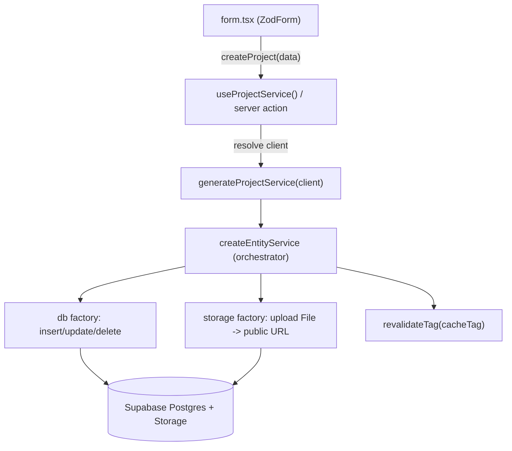

# Entity Service Layer (Supabase + Next.js)

A reusable architecture to avoid repeating CRUD logic across Supabase-backed features.

## Key features

Supabase + Next.js patterns that are usually painful — client types, caching, file uploads, RLS contexts — are solved once in the core layer. Each entity is ~30 lines of config.

- **One-line CRUD** — `create`, `update`, `remove`, `getById`, `get`, `getAll`, `getAllSorted`, `saveSort` on every entity, no per-table boilerplate.
- **Automatic file handling** — drop a `File` in your payload and it is uploaded, renamed uniquely, and its public URL saved in the row. Removals and replacements are cleaned up for you.
- **Four Supabase clients, one swap** — server (auth), public (cache-safe), admin (RLS bypass), browser — injected per call, never module-scoped.
- **Cache-correct by default** — writes call `revalidateTag`; cached reads use the cookie-free public client so `unstable_cache` never breaks.
- **Uniform responses** — every method returns `{ data, success, error, message }`.
- **Typed end to end** — pass your schema/record types; `data` is typed at the call site.
- **Copy-paste templates** — single- or multi-client starter; scaffold a table in minutes.

See [Database operations](#database-operations) and [Storage / image uploads](#storage--image-uploads) for the full picture.

---

## Architecture


---

## End-to-end flow

From a form submit to Supabase, here is the whole path — note that you only ever write the thin call site; everything else is handled by the layer:



1. A component calls a thin action/hook with a typed payload.
2. The getter resolves the right Supabase client (server / admin / public / browser).
3. The orchestrator uploads any `File` fields, runs the DB op, then invalidates the cache tag.
4. A uniform `{ data, success, error, message }` comes back.

The real call site stays this small:

```ts
// components/form.tsx
const projectService = useProjectService();
const onSubmit = (data: ProjectSchemaTypes) => projectService.createProject(data);
// image: File -> uploaded automatically -> row stored with its public URL
```

---

## Why this exists

Instead of rewriting the same code for every table (projects, test, etc.), we use:

- Shared factories in `services/core/`
- One folder per entity in `services/entities/` (`core.ts` + `server.ts`, optionally `client.ts`)
- Non-entity logic in `services/infrastructure/`
- Supabase client resolution in `@/lib/supabase`

---

## Folder structure

```txt
services/
├── core/
│   ├── entity.ts              # createEntityService — main factory entry (the Orchestrator)
│   ├── factories/
│   │   ├── db.ts
│   │   ├── storage.ts
│   │   └── sorting.ts
│   ├── types/
│   └── README.MD
│
├── entities/
│   ├── templates/
│   │   ├── single-client/     # copy-paste starter (server-only, one client)
│   │   └── multi-client/      # copy-paste starter (browser + admin + public)
│   ├── test/                  # live single-client example
│   └── projects/              # live multi-client example
│
└── etc...
```

**Rule:** Components import from `@/services/entities/{feature}/server` — never from `core.ts` directly (except `client.ts` hooks for browser usage).

### Templates

| Template | Files | `core.ts` exports | `server.ts` |
| -------- | ----- | ----------------- | ----------- |
| `templates/single-client/` | `core.ts`, `server.ts` | `featureServiceConfig` + `getFeatureService()` | Calls `getFeatureService()` from core |
| `templates/multi-client/` | `core.ts`, `server.ts`, `client.ts` | `featureServiceConfig` + `generateFeatureService(client)` | Private `getFeatureService(customClient?)` |

Live examples: `entities/test/` (single client), `entities/projects/` (multi client).

---

## Core idea

Every entity defines the same `featureServiceConfig` (`EntityServiceConfig`) — table, storage, and sorting with **no client baked in** (see [Configuration](#configuration)). The only thing that changes between entities is **how the Supabase client is bound** at call time:

- **Server-only** (`test/`, `templates/single-client/`) — `core.ts` exports an async `getFeatureService()` that always binds `createServerClient()`. `server.ts` calls it in each action.
- **Any client** (`projects/`, `templates/multi-client/`) — `core.ts` exports a pure `generateFeatureService(client)`. `server.ts` resolves the client per request (server by default, with admin/public overrides) and `client.ts` passes `createBrowserClient()` for browser usage.

Both start from the identical config object; pick the binding that matches where the entity is used.

### `server.ts` — shared responsibilities

- Thin action wrappers that call the service per request
- Sorting orchestration, cached reads, cross-service workflows
- Manual upload logic only for nested/complex fields (e.g. JSON arrays)
- All exports use `"use server"` and return `response()`

---

## Configuration

The config is the **same for every entity** — table, storage, and sorting, with **no client inside**. Define `featureServiceConfig` once:

```ts
import { createEntityService } from "@/services/core/entity";
import { EntityServiceConfig } from "@/services/core/types";

export const featureServiceConfig: EntityServiceConfig = {
  dbServiceConfig: {
    tableName: "your_table",
    cacheTag: "your-cache-tag",
    primaryKey: "id",
  },
  storageServiceConfig: {
    bucketName: "your_bucket",
    groupFolder: "your_folder",
  },
  sortingServiceConfig: {
    tableName: "sort",
    sortRowId: "your_table",
    primaryKey: "column_id",
  },
};
```

The only difference between entities is **how the Supabase client is bound** to that config — pick one:

```ts
// Server-only: always the authenticated server client (test/, templates/single-client/)
import { createServerClient } from "@/lib/supabase/server";
import { revalidateTag } from "next/cache";

export const getFeatureService = async () => {
  const client = await createServerClient();
  return createEntityService({
    supabaseClient: client,
    revalidateFn: revalidateTag,
    ...featureServiceConfig,
  });
};

// Any client passed in — server, admin, public, or browser (projects/, templates/multi-client/)
import type { SupabaseClient } from "@supabase/supabase-js";

export const generateFeatureService = (
  client: SupabaseClient,
  revalidateFn?: (tag: string) => void,
) =>
  createEntityService({
    supabaseClient: client,
    revalidateFn,
    ...featureServiceConfig,
  });
```

For the generator, `server.ts` resolves the client per request:

```ts
const getFeatureService = async (customClient?: SupabaseClient) => {
  const client = customClient ?? (await createServerClient());
  return generateFeatureService(client, revalidateTag);
};
```

| Config block | Required | Description |
| ------------ | -------- | ----------- |
| `dbServiceConfig.tableName` | yes | Supabase table name |
| `dbServiceConfig.cacheTag` | yes | Tag used for `revalidateTag` on writes |
| `storageServiceConfig` | no | Enables automatic file upload/remove on create/update/delete |
| `sortingServiceConfig` | no | Enables `getSort`, `saveSort`, `getAllSorted` |
| `supabaseClient` | yes | Always passed at service creation — never in `EntityServiceConfig` |

Omit `storageServiceConfig` or `sortingServiceConfig` when not needed, or remove both for db-only entities.

---

## Database operations

Each service exposes the same methods. All take object params and return `ApiResponse<T>` (`{ data, success, error, message }`). Pass your `Record` type to type `data` at the call site.

### Create

```ts
const { data, success } = await service.create({ payload });
```

Inserts one row (`.insert().select().single()`), uploads any `File` fields first, then revalidates the cache tag.

### Update

```ts
await service.update({ id, payload });
```

Updates by `primaryKey`. Fetches the current row first so file changes can be diffed (a new `File` replaces and deletes the old one; an unchanged URL is kept).

### Delete

```ts
await service.remove({ id });
```

Deletes the row, then removes its storage files and its sort-order entry. Cache is revalidated on success.

### Read one

```ts
await service.getById<Record>({ id }); // by primary key
await service.get<Record>({ where: { slug }, shape: "single" }); // by unique field -> T | null
```

### Read many

```ts
await service.getAll<Record>({}); // all rows
await service.get<Record>({ where: { status: "approved" } }); // filtered
await service.get<Record>({ where, limit, orderBy: { column, ascending } }); // filter + sort + limit
```

### Sorted reads / saving order

```ts
await service.saveSort({ ids: [3, 1, 2] }); // persist manual order
await service.getAllSorted<Record>({}); // rows in saved order
await service.getAllSorted<Record>({ where: { status: "approved" } });
```

### At a glance

| Method | Params | Returns | Notes |
| ------ | ------ | ------- | ----- |
| `create` | `{ payload }` | `T` | uploads files, revalidates |
| `update` | `{ id, payload }` | `T` | diffs files, revalidates |
| `remove` | `{ id }` | `T` | cleans storage + sort entry |
| `getById` | `{ id }` | `T` | primary-key lookup |
| `get` | `{ where?, limit?, orderBy?, shape? }` | `T[]` or `T \| null` | `shape: "single"` for one row |
| `getAll` | `{}` | `T[]` | full table |
| `getAllSorted` | `{ where? }` | `T[]` | respects saved order |
| `saveSort` / `getSort` | `{ ids }` / `{}` | order row | needs `sortingServiceConfig` |

See [Query shape](#query-shape-get) and [Typed responses](#typed-responses) for return-type details.

---

## Response shape

Every action returns:

```ts
{
  data,
  success,
  error,
  message,
}
```

Use destructuring at call sites:

```ts
const { data, success, error, message } = await createProject({ payload });
const { data: isAdminUser } = await isAdmin({ userId });
```

---

## Param conventions

See [Database operations](#database-operations) for the full method list. Use **object params** for any action that takes arguments:

```ts
createFeature({ payload });
updateFeature({ id, payload });
deleteFeature({ id });
saveFeaturesSort({ ids });
getFeatureById({ id });
getProjectBySlug({ slug });
```

No-arg reads need no wrapper:

```ts
getFeatures();
getSortedProjects();
```

---

## Query shape (`get`)

`get()` accepts an optional `shape` param that controls the return type:

| `shape`            | Returns     | Use when                       |
| ------------------ | ----------- | ------------------------------ |
| `"list"` (default) | `T[]`       | Multiple rows (filters, lists) |
| `"single"`         | `T \| null` | One row by slug, route, etc.   |

```ts
// many rows
await featureService.get({ where: { status: "approved" } });

// one row — no data[0] unwrapping
await featureService.get({ where: { slug: "my-project" }, shape: "single" });
```

Use `getById({ id })` for primary-key lookups. Use `get({ where, shape: "single" })` for unique field lookups.

---

## Typed responses

Entity and db methods are generic — pass your schema type so `data` is typed at the call site. All methods return `ApiResponse<T>` where `data` is `T | null`.

| Method                     | Generic                                | `data` type |
| -------------------------- | -------------------------------------- | ----------- |
| `create`                   | inferred from `payload`                | `T`         |
| `update`                   | inferred from `payload`                | `T`         |
| `remove`                   | optional (defaults to `PayloadRecord`) | `T`         |
| `getById`                  | required at call site                  | `T`         |
| `getAll`                   | required at call site                  | `T[]`       |
| `get({ shape: "list" })`   | required at call site                  | `T[]`       |
| `get({ shape: "single" })` | required at call site                  | `T \| null` |
| `getAllSorted`             | required at call site                  | `T[]`       |

```ts
import type { ProjectRecord, ProjectSchemaTypes } from "@/schemas/projectSchema";

// Schema types — form payloads (create/update)
// Record types — DB rows (reads), e.g. YourRecord = YourSchemaType & { id: number }

// writes — T inferred from payload
await projectService.create({ payload: formData });
await projectService.update({ id, payload: formData });

// reads — pass Record type explicitly
const { data: row } = await projectService.getById<ProjectRecord>({ id });
const { data: rows } = await projectService.getAll<ProjectRecord>({});
const { data: approved } = await projectService.getAllSorted<ProjectRecord>({
  where: { status: "approved" },
});
```

Inner factory responses use `success` (not `!error`) before cache invalidation and before returning to actions.

---

## Client types

Four Supabase clients are available from `@/lib/supabase`:

| Client | Factory | Use case |
| ------ | ------- | -------- |
| Server | `createServerClient()` | Cookie-aware, authenticated server actions (default writes) |
| Public | `createPublicServerClient()` | Cache-safe reads inside `unstable_cache` (no cookies) |
| Admin | `createAdminClient()` | Bypass RLS for admin operations |
| Browser | `createBrowserClient()` | Client components via `client.ts` hook |

Multi-client entities pass these into `getFeatureService(customClient)`. Single-client entities always use `createServerClient()` via `getFeatureService()` in core.

```ts
type DbClientType = "server" | "public" | "admin" | "browser";
```

`resolveClient()` from `@/lib/supabase` is also available but entities resolve clients explicitly in `server.ts`.

---

## Sorting

When `sortingServiceConfig` is set:

```ts
await featureService.saveSort({ ids: [1, 2, 3] });
await featureService.getSort();
// sort entry is removed automatically on remove()
```

Fetch sorted rows via `getAllSorted({})`:

```ts
await featureService.getAllSorted({});
await featureService.getAllSorted({ where: { status: "approved" } });

export const getSortedItems = unstable_cache(
  async () => {
    const service = await getFeatureService(createPublicServerClient());
    return service.getAllSorted({});
  },
  ["sorted-items"],
  { tags: [featureServiceConfig.dbServiceConfig.cacheTag ?? ""] },
);
```

---

## Caching

Only **`entity.ts`** calls `updateTag` — not `factories/db.ts`. Cache tags live on `dbServiceConfig.cacheTag` and are invalidated after successful writes (`create`, `update`, `remove`, `saveSort`).

Wrap custom reads with `unstable_cache` and the same tag. Use `createPublicServerClient()` inside the cache callback — never `createServerClient()` (cookies break caching). Requires the multi-client pattern so `getFeatureService` accepts a client override:

```ts
export const getSortedApprovedItems = unstable_cache(
  async () => {
    const service = await getFeatureService(createPublicServerClient());
    return service.getAllSorted({ where: { status: "approved" } });
  },
  ["sorted-approved-items"],
  { tags: [featureServiceConfig.dbServiceConfig.cacheTag ?? ""] },
);
```

If you need cached public reads, use `templates/multi-client/` (or add an optional `customClient` param to your getter).

---

## Storage / image uploads

When `storageServiceConfig` is set, `createEntityService` handles uploads automatically — you never call the Storage API yourself for standard fields. Enable it once:

```ts
storageServiceConfig: {
  bucketName: "your_bucket",
  groupFolder: "projects",
  payloadKey: "title", // optional — file folder slug comes from this field
}
```

What makes it easy:

- **Deep payload scan** — `collectFiles` recursively finds every `File` in the payload (top-level or nested), so uploads are wired automatically for standard fields.
- **Predictable paths** — files land at `groupFolder/{slug}/{name}-id-{timestamp}.{ext}`. The `slug` comes from `payloadKey` (falling back to `title`, `slug`, `name`, then `id`), and filenames are sanitized and timestamped to avoid collisions.
- **Smart updates** — on update, new `File`s upload and any old asset URL no longer present in the payload is deleted (`collectUrls` diff). Unchanged `string` URLs are skipped.
- **Full cleanup on delete** — `removeTree` deletes all matching bucket files for the row.
- **Form convention** — pass a `File` for a new or replaced image, a `string` URL to keep the existing one.

Lifecycle:

| Operation | You pass | Orchestrator does |
| --------- | -------- | ----------------- |
| **create** | `File` field(s) | upload → store public URL(s) in the new row |
| **create** | only strings | plain insert, no storage call |
| **update** | new `File` | upload new, delete the replaced old file |
| **update** | unchanged URL | left as-is |
| **update** | URL removed from payload | old file deleted from bucket |
| **remove** | `{ id }` | row deleted, then all its bucket files removed |
| **nested** | `File` inside arrays/objects | uploaded too (scan is recursive); manual cleanup only for exotic shapes |

If a payload contains `File`s but no `storageServiceConfig` is set, `create`/`update` return a `"Storage service is not enabled"` error (`validateStorageRequirement`). For nested uploads in unusual shapes (e.g. `sub_items[].image`), keep manual cleanup logic in `server.ts`.

---

## Adding a new entity

| Need | Copy |
| ---- | ---- |
| Server-only, one authenticated client | `templates/single-client/` |
| Browser hook, admin bypass, or public cached reads | `templates/multi-client/` |

1. Copy the matching template → `services/entities/your-feature/`
2. Replace placeholders (`your_table`, `your-cache-tag`, `YourSchemaType`, etc.)
3. Add schema types in `@/schemas/`
4. Import actions from `server.ts` in components — never import entity services directly

| Pattern | `core.ts` | `server.ts` | `client.ts` |
| ------- | --------- | ----------- | ----------- |
| Single | `getFeatureService()` | calls getter from core | — |
| Multi | `generateFeatureService(client)` | private `getFeatureService(customClient?)` | `useFeatureService()` hook |

---

## Rules

1. Don't duplicate CRUD — use `createEntityService` from `@/services/core/entity`
2. Don't force complex logic into the factory — keep it in `server.ts`
3. Components call `server.ts` actions, not entity services directly
4. Keep param shapes consistent (object params)
