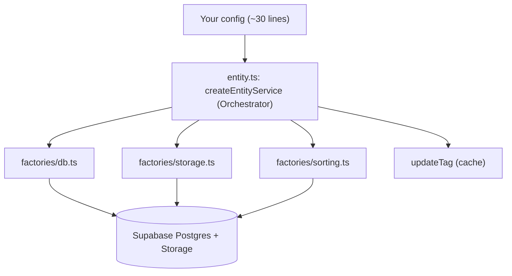

# Supabase backend orchestrator

Stop rewriting the same Supabase CRUD for every table. Describe a table once, get `create`, `update`, `remove`, and typed reads for free.

**The Lazy Dev philosophy:** you write the thin call site, the layer does the rest. Slugifying file names, uploading to Storage, fetching public URLs, diffing replaced images, invalidating cache tags, picking the right client for the right context — all solved once in `services/core/`. Every new table is ~30 lines of config and a one-line `service.create({ payload })`.

---

## Quick Start

```bash
# 1. Drop the layer into an existing Next.js + Supabase project
npx create-supabase-orchestrator

# 2. Create a new entity
npx create-supabase-orchestrator entity blog          # single-client (default)
npx create-supabase-orchestrator entity blog multi    # multi-client (adds client.ts)
```

`npx create-supabase-orchestrator` create three folders (writes under `src/` when it exists, else project root; asks before overwriting, or pass `--force` / `-y` in CI):

- `services/core/` — the engine (orchestrator + db/storage/sorting factories)
- `services/entities/` — `templates/` and `standalone-factories/` starting points
- `lib/supabase/` — Standard client factories.
  > *While you can initialize clients manually elsewhere, we **strongly recommend** this pattern as it aligns with official Supabase/Next.js best practices for SSR and RLS.*

Then make sure your project has:

- the `@/`* path alias in `tsconfig.json`, e.g. `"paths": { "@/*": ["./src/*"] }`
- peer deps: `npm i @supabase/supabase-js @supabase/ssr next`

> In-repo equivalent of the entity generator: `npm run entity:generate blog [multi]`.

---

## Before vs. After

Insert a row with an uploaded image and invalidate the cache.

**Before** — by hand, repeated for every table:

```ts
const supabase = await createServerClient();
const slug = title.toLowerCase().replace(/\s+/g, "-");
const path = `projects/${slug}/cover-${Date.now()}.${image.name.split(".").pop()}`;

const { error: upErr } = await supabase.storage.from("projects").upload(path, image);
if (upErr) return { success: false, error: upErr.message };
const { data: { publicUrl } } = supabase.storage.from("projects").getPublicUrl(path);

const { data, error } = await supabase.from("projects")
  .insert({ title, image: publicUrl }).select().single();
if (error) return { success: false, error: error.message };

updateTag("projects");
return { success: true, data };
```

**After** — every table, every time:

```ts
const { data, success } = await service.create({ payload });
// upload, unique path, public URL, typed insert, and updateTag all handled
```

---

## Architecture (TL;DR)

Read it bottom-up: pure builders at the base, a manager that wires them, your config on top.


```mermaid
flowchart TD
  Config["Your config (~30 lines)"] --> Orch["entity.ts: createEntityService (Orchestrator)"]
  Orch --> Db["factories/db.ts"]
  Orch --> Storage["factories/storage.ts"]
  Orch --> Sort["factories/sorting.ts"]
  Orch --> Cache["updateTag (cache)"]
  Db --> Supa[("Supabase Postgres + Storage")]
  Storage --> Supa
  Sort --> Supa
```


- **Factories (`services/core/factories/`)** — three stateless, pure builders. Each takes a Supabase client + its config slice and returns one capability, nothing more:
  - `db.ts` — table operations: insert/update/delete + filtered select.
  - `storage.ts` — file lifecycle: collect `File`s, upload to predictable paths, diff/replace on update, clean up on delete.
  - `sorting.ts` — persisted manual order.
- **Orchestrator (`services/core/entity.ts`)** — `createEntityService` wires the factories and owns sequencing: upload files → write row → `updateTag` on success; on update it diffs replaced images, on delete it cleans files + sort entry. It is the **only** layer that touches the cache, and it normalizes everything into `{ data, success, error, message }`.
- **Config** — a plain object (table, storage, sorting, no client inside). The only per-entity difference is how the Supabase client is bound.

---

## Entity Usage & API

Every service exposes the same methods. All take object params and return `ApiResponse<T>` = `{ data, success, error, message }`. Pass your `Record` type to type `data` at the call site.

```ts
const { data, success, error, message } = await service.create({ payload });
```


| Method         | Params                                 | Returns     | Notes                                          |
| -------------- | -------------------------------------- | ----------- | ---------------------------------------------- |
| `create`       | `{ payload }`                          | `T`         | uploads files, revalidates cache               |
| `update`       | `{ id, payload }`                      | `T`         | diffs files + clean storage, revalidates cache |
| `remove`       | `{ id }`                               | `T`         | cleans storage + sort entry                    |
| `getById`      | `{ id }`                               | `T`         | primary-key lookup                             |
| `get`          | `{ where?, limit?, orderBy?, shape? }` | `T[]` or `T | null`                                          |
| `getAll`       | `{}`                                   | `T[]`       | full table                                     |
| `getAllSorted` | `{ where? }`                           | `T[]`       | respects saved order                           |
| `saveSort`     | `{ ids }`                              | order row   | needs `sortingServiceConfig`                   |
| `getSort`      | `{}`                                   | order row   | needs `sortingServiceConfig`                   |


```ts
// writes — T inferred from payload
await service.create({ payload });
await service.update({ id, payload });

// reads — pass your Record type; use object params
await service.getById<Record>({ id });
await service.get<Record>({ where: { slug }, shape: "single" }); // T | null
await service.get<Record>({ where: { status: "approved" } });    // T[]
await service.getAll<Record>({});
await service.getAllSorted<Record>({ where: { status: "approved" } });
```

**Automatic file handling:** set `storageServiceConfig` and drop a `File` in the payload — it is uploaded to `groupFolder/{slug}/{name}-id-{timestamp}.{ext}`, its public URL stored in the row. Nested `File`s are found recursively. On update, new `File`s replace old ones (unchanged string URLs kept); on delete, all the row's files are removed. Pass a `File` to add/replace, a `string` URL to keep.

**Caching:** only `entity.ts` calls `updateTag` (on successful `create`/`update`/`remove`/`saveSort`). Wrap custom reads with `unstable_cache` + the same `cacheTag`, resolving the public client so cookies never break the cache:

```ts
export const getSortedApprovedItems = unstable_cache(
  async () =>
    runWithService("admin", (service) => service.getAllSorted({ where: { status: "approved" } })),
  ["sorted-approved-items"],
  { tags: [featureServiceConfig.dbServiceConfig.cacheTag ?? ""] },
);
```

---

## Configuration

A feature is one config object plus a choice of how the client is bound. The config is identical for every entity:

```ts
import { createEntityService } from "@/services/core/entity";
import { EntityServiceConfig } from "@/services/core/types";

export const featureServiceConfig: EntityServiceConfig = {
  dbServiceConfig: { tableName: "your_table", cacheTag: "your-cache-tag", primaryKey: "id" },
  storageServiceConfig: { bucketName: "your_bucket", groupFolder: "your_folder" }, // optional
  sortingServiceConfig: { tableName: "sort", sortRowId: "row_id", primaryKey: "column_id" }, // optional
};
```

Omit `storageServiceConfig` / `sortingServiceConfig` when not needed. Then pick a client binding:

- **Server-only** (`articles/`, `templates/single-client/`) — `core.ts` exports async `getFeatureService()` that always binds `createServerClient()`; `server.ts` calls it per action.
- **Any client** (`projects/`, `templates/multi-client/`) — `core.ts` exports pure `generateFeatureService(client)`; `server.ts` builds `runWithService = createServiceRunner(generateFeatureService)` and each action picks the client via `runWithService(clientType, action)`; `client.ts` binds `createBrowserClient()`.

Keep the thin `"use server"` wrappers, sorting orchestration, cached reads, and any manual upload logic for exotic nested fields in `server.ts`.

---

## Creating an Entity: Single Client vs Multi Clients

Every entity is 2–3 files. The config object is identical; only the client binding differs.


| Pattern       | Files                               | `core.ts` exports                |
| ------------- | ----------------------------------- | -------------------------------- |
| Single-client | `core.ts`, `server.ts`              | `getFeatureService()`            |
| Multi-client  | `core.ts`, `server.ts`, `client.ts` | `generateFeatureService(client)` |


Scaffold either pattern:

```bash
npx create-supabase-orchestrator entity blog          # single-client (default)
npx create-supabase-orchestrator entity blog multi    # multi-client (adds client.ts)
```

Live examples: `entities/articles/` (single), `entities/projects/` (multi).

### Single-client (server-only)

`core.ts` — config + async getter that always binds the authenticated server client:

```ts
import { createServerClient } from "@/lib/supabase/server";
import { createEntityService } from "@/services/core/entity";
import { updateTag } from "next/cache";

export const featureServiceConfig: EntityServiceConfig = { /* ... */ };

export const getFeatureService = async () => {
  const client = await createServerClient();
  return createEntityService({
    supabaseClient: client,
    updateTag,
    ...featureServiceConfig,
  });
};
```

`server.ts` — thin `"use server"` actions; call `getFeatureService()` per request:

```ts
"use server";

import { unstable_cache } from "next/cache";
import { getFeatureService, featureServiceConfig } from "./core";

export const createFeature = async ({ payload }: { payload: YourSchemaType }) => {
  const service = await getFeatureService();
  return service.create({ payload });
};

export const getFeatures = async () => {
  const service = await getFeatureService();
  return service.getAll<YourRecord>({});
};

export const getSortedFeaturesCached = unstable_cache(
  async () => {
    const service = await getFeatureService();
    return service.getAllSorted<YourRecord>({});
  },
  ["sorted-feature"],
  { tags: [featureServiceConfig.dbServiceConfig.cacheTag ?? ""] },
);
```

Usage:

```ts
import { createFeature, getFeatures } from "@/services/entities/blog/server";

const { data, success } = await createFeature({ payload });
const { data: rows } = await getFeatures();
```

### Multi-client (browser + admin + public)

`core.ts` — config + pure generator; client is passed in at call time:

```ts
import { createEntityService } from "@/services/core/entity";
import type { SupabaseClient } from "@supabase/supabase-js";

export const featureServiceConfig: EntityServiceConfig = { /* ... */ };

export const generateFeatureService = (
  client: SupabaseClient,
  updateTag?: (tag: string) => void,
) =>
  createEntityService({
    supabaseClient: client,
    updateTag,
    ...featureServiceConfig,
  });
```

`server.ts` — runner resolves the right server-side client per action:

```ts
"use server";

import { unstable_cache } from "next/cache";
import { generateFeatureService, featureServiceConfig } from "./core";
import { createServiceRunner } from "@/services/core/runtime/runner";

const runWithService = createServiceRunner(generateFeatureService);

export const createFeature = async ({ payload }: { payload: YourSchemaType }) =>
  runWithService("server", (service) => service.create({ payload }));

export const createFeatureAsAdmin = async ({ payload }: { payload: YourSchemaType }) =>
  runWithService("admin", (service) => service.create({ payload }));

export const getFeatures = async () =>
  runWithService("server", (service) => service.getAll<YourRecord>({}));

export const getFeaturesCached = unstable_cache(
  async () => runWithService("public", (service) => service.getAll<YourRecord>({})),
  ["your-feature-list"],
  { tags: [featureServiceConfig.dbServiceConfig.cacheTag ?? ""] },
);
```

`client.ts` — browser hook for instant UI updates in Client Components:

```ts
"use client";

import { useMemo } from "react";
import { createBrowserClient } from "@/lib/supabase/client";
import { generateFeatureService } from "./core";

export const useFeatureService = () => {
  const browserClient = useMemo(() => createBrowserClient(), []);
  const service = useMemo(
    () => generateFeatureService(browserClient),
    [browserClient],
  );
  return { service };
};
```

Use from a Client Component:

```ts
import { useFeatureService } from "@/services/entities/blog/client";

const { service } = useFeatureService();
const { data, success } = await service.create({ payload });
```

**Client types at a glance** — pick per action with `runWithService(clientType, action)`:


| Client  | Factory                      | Use case                                                    |
| ------- | ---------------------------- | ----------------------------------------------------------- |
| Server  | `createServerClient()`       | Cookie-aware, authenticated server actions (default writes) |
| Public  | `createPublicServerClient()` | Cache-safe reads inside `unstable_cache` (no cookies)       |
| Admin   | `createAdminClient()`        | Bypass RLS for admin operations                             |
| Browser | `createBrowserClient()`      | Client components via `client.ts` hook                      |


> **Import rule:** components call actions from `server.ts` or the hook from `client.ts` — never import from `core.ts`.

After scaffolding, finish by hand: replace domain placeholders (`your_table`, `your-cache-tag`, `YourData`, `YourRecord`), add types in `@/schemas/`, then wire components to `server.ts` / `client.ts`.

---

## Modularity: the Parts or the Whole

The Orchestrator is the primary way to build a full-featured entity — but you are never forced to take the whole pipeline. Each factory (`createDbService`, `createStorageService`, `createSortingService`) is a standalone, pure builder you can use on its own, with none of the Orchestrator's overhead.

All factory methods return `ApiResponse<T>` = `{ data, success, error, message }` unless noted. The Orchestrator exposes db + sorting methods at the entity level (`create`, `getAllSorted`, etc.) and calls storage internally — you rarely touch storage factory methods directly unless using standalone factories.

### Factory methods

**`createDbService`** — raw table operations:

| Method    | Params                                 | Notes                       |
| --------- | -------------------------------------- | --------------------------- |
| `create`  | `{ payload }`                          | insert + select single      |
| `update`  | `{ id, payload }`                      | update by `primaryKey`      |
| `remove`  | `{ id }`                               | delete + select single      |
| `getById` | `{ id }`                               | primary-key lookup          |
| `get`     | `{ where?, limit?, orderBy?, shape? }` | `shape: "single"` → one row |
| `getAll`  | `{}`                                   | full table select           |

**`createStorageService`** — file lifecycle:

| Method              | Params                                       | Notes                                    |
| ------------------- | -------------------------------------------- | ---------------------------------------- |
| `upload`            | `{ file, path? }`                            | upload → public URL                      |
| `remove`            | `{ fileUrl }`                                | delete one file from bucket              |
| `removeTree`        | `{ payload }`                                | delete all bucket URLs found in payload  |
| `processUploadTree` | `{ payload, payloadKey? }`                   | scan for `File`s, upload, return payload |
| `processUpdateTree` | `{ databaseSnapshot, payload, payloadKey? }` | upload new files, delete removed URLs    |
| `hasBinaryAssets`   | `(payload)`                                  | boolean — any `File` in payload?         |

`processUploadTree` / `processUpdateTree` return the mutated `PayloadRecord` directly (not `ApiResponse`).

**`createSortingService`** — persisted manual order (requires a `dbService` on your `sort` table):

| Method                | Params             | Notes                            |
| --------------------- | ------------------ | -------------------------------- |
| `createSort`          | `{ payload }`      | insert sort row for entity       |
| `getSort`             | `{}`               | fetch saved order row            |
| `saveSort`            | `{ ids }`          | persist manual order array       |
| `removeItemFromOrder` | `{ id }`           | drop one id from order on delete |
| `sortByOrder`         | `{ items, order }` | in-memory sort by saved id list  |

Need plain table access for a simple lookup table? Reach for the db factory directly:

```ts
import { createDbService } from "@/services/core/factories/db";

// A simple lookup table — no storage, no sorting, no cache wiring
const db = createDbService({ tableName: "db", supabaseClient });
const { data } = await db.getAll({});
```

Reach for a **single factory** when you need exactly one capability, or the **Orchestrator** when you want the whole pipeline (uploads + db + sorting + cache) in one call. It's a flexible toolkit, not an all-or-nothing framework. Runnable examples live in `entities/standalone-factories/` (`db-only.ts`, `storage-only.ts`, `sorting-only.ts`).

---

## Folder structure

```txt
services/
├── core/
│   ├── entity.ts              # createEntityService — the Orchestrator (manager)
│   ├── factories/             # pure builders: db.ts, storage.ts, sorting.ts
│   ├── runtime/               # runner.ts (runWithService) + serverResolver.ts
│   └── types/
└── entities/
    ├── templates/             # single-client/ and multi-client/ starters
    ├── standalone-factories/  # use one factory alone (db / storage / sorting)
    ├── articles/              # live single-client example
    └── projects/              # live multi-client example
```

---

## Rules

1. Don't duplicate CRUD — use `createEntityService` from `@/services/core/entity`.
2. Don't force complex logic into the factory — keep it in `server.ts`.
3. Components call `server.ts` actions (or the `client.ts` hook), never entity services from `core.ts`.
4. Keep param shapes consistent — object params (`{ payload }`, `{ id, payload }`) for all methods.

